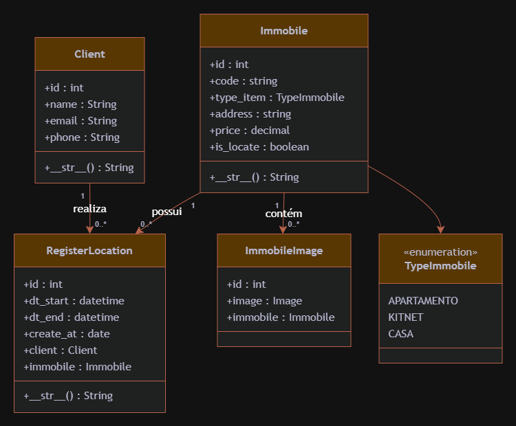

# Diagrama de Classes

O sistema é composto por quatro classes principais: Client, Immobile, ImmobileImage e RegisterLocation, além da enumeração TypeImmobile, responsável por definir os tipos de imóveis disponíveis. A classe Client representa os clientes da imobiliária, armazenando informações como nome, e-mail e telefone. A classe Immobile representa os imóveis disponíveis para locação, contendo informações como código, tipo, endereço, valor da locação e status de disponibilidade. A classe ImmobileImage representa as imagens associadas aos imóveis, permitindo que um mesmo imóvel possua uma ou mais imagens. Por fim, a classe RegisterLocation representa o registro das locações realizadas, relacionando um cliente a um imóvel e armazenando o período da locação, composto pelas datas de início e término, além da data de criação do registro.