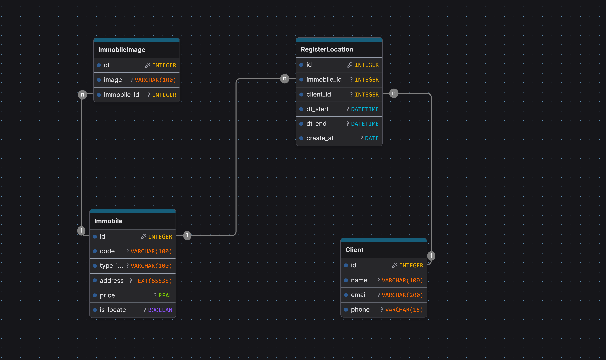

# Diagrama de Entidade-Relacionamento (DER)

Entidades:

- Client
- Immobile
- ImmobileImage
- RegisterLocation

Relacionamentos:

- Client (1) → (N) RegisterLocation
- Immobile (1) → (N) RegisterLocation
- Immobile (1) → (N) ImmobileImage
