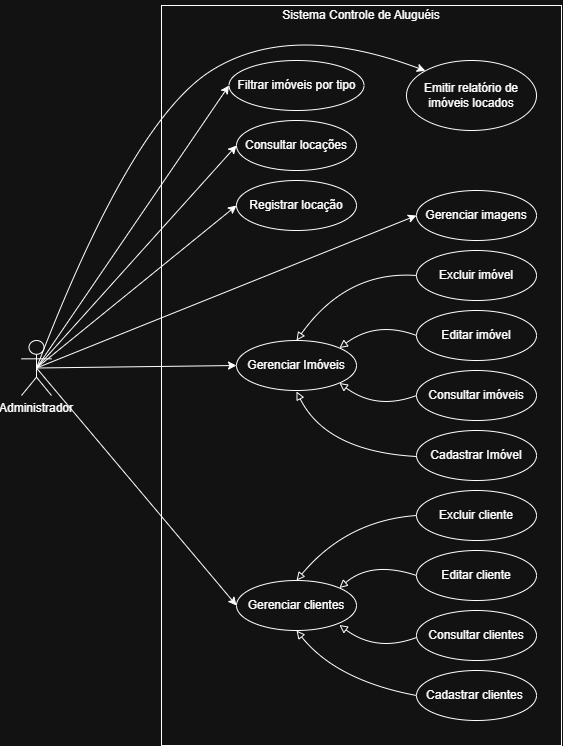

# Casos de Uso

O sistema permite ao administrador realizar as seguintes operações:

- Cadastrar clientes;
- Consultar clientes;
- Editar clientes;
- Excluir clientes;
- Cadastrar imóveis;
- Consultar imóveis;
- Editar imóveis;
- Excluir imóveis;
- Filtrar imóveis por tipo;
- Cadastrar imagens dos imóveis;
- Registrar locações;
- Consultar locações;
- Emitir relatório de imóveis locados.
